  

## About Me

I am a developer and entrepreneur focused on the intersection of artificial intelligence, autonomous workflow optimization, and high-performance software systems. 

* ⚡ **Founder &amp; CEO** of **Maini Labs**
* 🤖 **Building** intelligent AI agents, enterprise automation systems, internal tools, and custom software
* 🧠 **Currently Focused** on engineering AI-first solutions to replace repetitive manual labor
* 🚀 **Core Interests**: Cognitive architectures, backend scalability, and product development

---

## Currently Building

  

---

## Tech Stack

### Core Technologies

  
  &nbsp;
  
  &nbsp;
  

### Other Technologies

  

---

## Featured Projects

<table width="100%" border="0" cellpadding="10" cellspacing="0">
  <tr>
    <td width="50%" valign="top">
      <h4>🌐 Maini Labs</h4>
      
<em>The core enterprise hub for autonomous AI automation.</em>

      <a href="https://github.com/adhyayanmaini" target="_blank"><code>View Repository</code></a>
    </td>
    <td width="50%" valign="top">
      <h4>🧠 Maini AI</h4>
      
<em>State-of-the-art cognitive agent architecture and reasoning engines.</em>

      <a href="https://github.com/adhyayanmaini" target="_blank"><code>View Repository</code></a>
    </td>
  </tr>
  <tr>
    <td width="50%" valign="top">
      <h4>⚡ AI Automation Platform</h4>
      
<em>Visual workflow engine for orchestration of intelligent background jobs.</em>

      <a href="https://github.com/adhyayanmaini" target="_blank"><code>View Repository</code></a>
    </td>
    <td width="50%" valign="top">
      <h4>🛠️ Developer Tools</h4>
      
<em>Lightweight, modular utility toolkits designed for modern engineers.</em>

      <a href="https://github.com/adhyayanmaini" target="_blank"><code>View Repository</code></a>
    </td>
  </tr>
</table>

---

## GitHub Activity

### Contribution History

  <picture>
    <source media="(prefers-color-scheme: dark)" srcset="https://raw.githubusercontent.com/adhyayanmaini/adhyayanmaini/output/github-snake-dark.svg" />
    <source media="(prefers-color-scheme: light)" srcset="https://raw.githubusercontent.com/adhyayanmaini/adhyayanmaini/output/github-snake.svg" />
    
  </picture>

### Developer Metrics

  
  &nbsp;
  

  

---

## Connect

  
  &nbsp;
  
  &nbsp;
  
  &nbsp;
  

   
  

